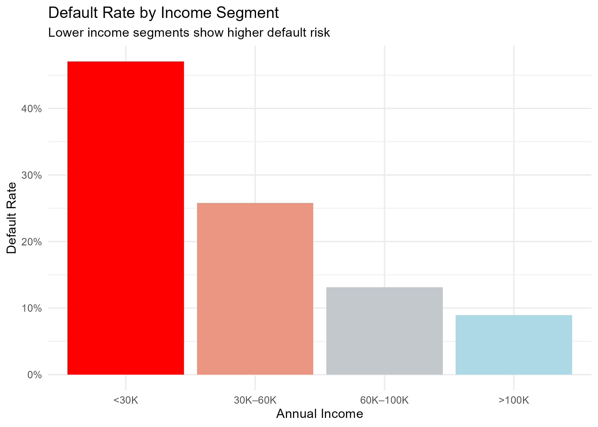
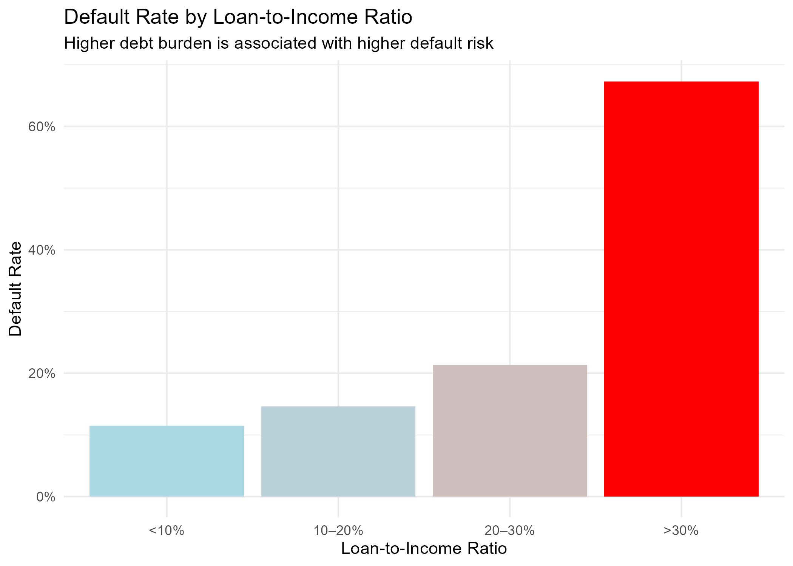

# Credit Risk Portfolio Analysis (R)

End-to-end credit risk portfolio analysis using **R**.

This project demonstrates data cleaning, feature engineering, KPI development, and risk segmentation for a consumer lending portfolio.

The goal is to simulate a simplified credit risk analysis workflow similar to what a data analyst might perform in a financial institution.

---

## Project Overview

This analysis focuses on identifying patterns associated with loan default risk using borrower and loan-level data.

The workflow includes:

- Data cleaning and preprocessing  
- Feature engineering (risk indicators)  
- Portfolio KPI development  
- Risk segmentation  
- Data visualization  
- Reproducible analysis pipeline  

---

## Tools & Libraries

- `tidyverse` – data manipulation and visualization  
- `janitor` – data cleaning  
- `scales` – percentage formatting  
- `here` – reproducible file paths  
- `ggplot2` – visualization  

---

## Project Structure

```text
credit-risk-portfolio-analysis-r/
│
├── data/
│   └── credit_risk_dataset.csv
│
├── scripts/
│   └── credit_risk_analysis.R
│
├── figures/
│   ├── default_rate_by_income.png
│   └── default_rate_by_lti.png
│
├── outputs/
│   ├── portfolio_kpi.csv
│   ├── kpi_default_by_income.csv
│   ├── kpi_default_by_lti.csv
│   └── missing_values_summary.csv
│
├── README.md
└── LICENSE
```

---

## Dataset

The dataset contains borrower and loan characteristics, including:

- Income  
- Loan amount  
- Employment length  
- Interest rate  
- Loan purpose  
- Loan grade  
- Loan status (target variable)  

Target variable:

- `loan_status` (1 = default, 0 = non-default)

---

## Data Cleaning & Preparation

Key preprocessing steps:

- Handled missing values in employment length  
- Standardized column names using `janitor::clean_names()`  
- Converted raw variables into analytical format  
- Created derived features:
  - Loan-to-Income Ratio  
  - Income Buckets  
  - Risk segmentation variables  

---

## Feature Engineering

New variables were created to improve risk interpretation:

- **Loan-to-Income Ratio (LTI)**  
- **Income Buckets** (<30K, 30K–60K, etc.)  
- **LTI Buckets** (<10%, 10–20%, etc.)  

These features help segment borrowers by financial risk exposure.

---

## Key Metrics (KPIs)

Portfolio KPIs were computed using R:

### Core KPIs:
- Total number of loans  
- Portfolio default rate  
- Missing data summary  

### Segment KPIs:
- Default rate by income group  
- Default rate by loan-to-income ratio  

---

## Visualizations

### Default Rate by Income Segment



This chart shows how default risk varies across income groups.

---

### Default Rate by Loan-to-Income Ratio



This chart highlights how higher debt burden increases default probability.

---

## Key Insights

- Default risk increases significantly in lower income segments  
- Borrowers with higher loan-to-income ratios show higher default rates  
- Debt burden is a strong predictor of credit risk  

---

## Business Implications

- Income level is a key driver of default risk  
- Loan-to-income ratio can be used for underwriting decisions  
- Portfolio segmentation helps identify high-risk borrower groups  
- These insights support credit risk management and pricing strategies  

---

## How to Run the Project

1. Clone repository  
2. Open in RStudio  
3. Run:

```r
scripts/credit_risk_analysis.R
```

4. Outputs will be generated in:

- `figures/` → visualizations  
- `outputs/` → KPI tables  

---

## License

This project is licensed under the **MIT License**.

---

## Author

Sebastian Solano  

*Economist & Data Analyst* [LinkedIn](https://www.linkedin.com/in/sebastian-solanor1/) | [Portfolio](https://github.com/sebastian-solanor1)
